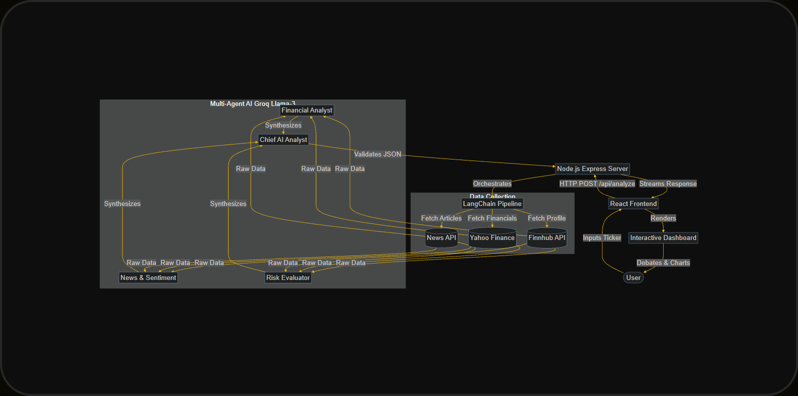
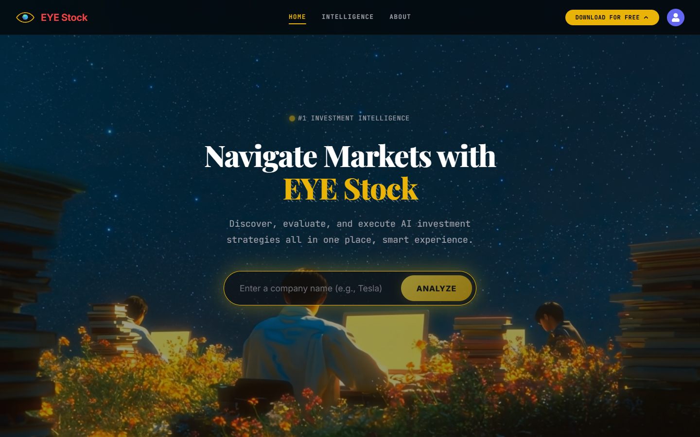
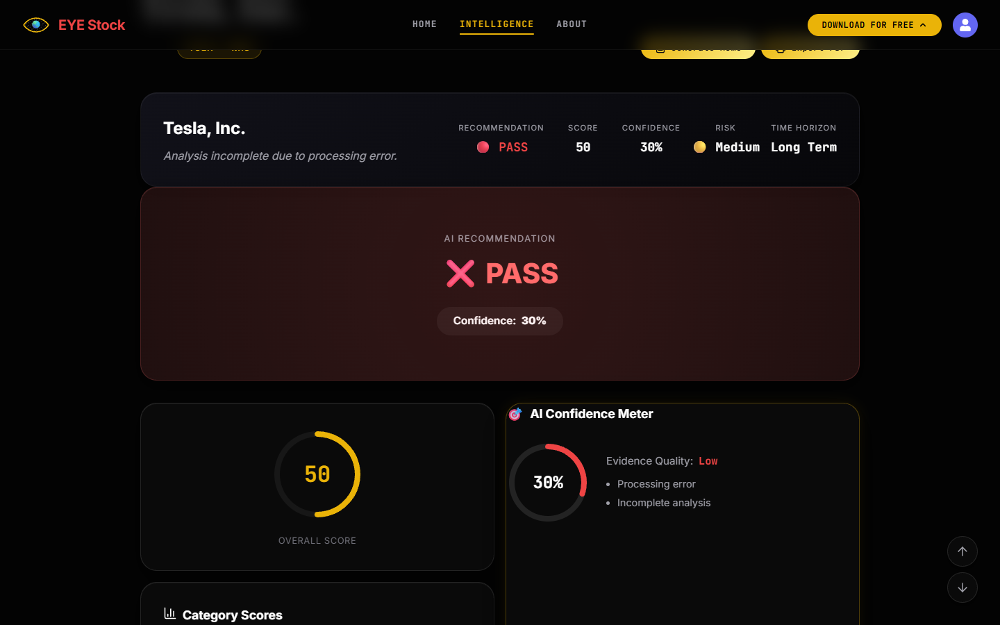

# AI Investment Research Agent

## 1. Overview

The AI Investment Research Agent is a premium, high-performance web application designed to synthesize complex financial data and news into actionable investment intelligence. 

**Main Features:**
- **Automated Financial Analysis:** Gathers real-time stock data, historical trends, and latest news.
- **AI-Powered Synthesis:** Generates comprehensive investment memos, SWOT analyses, and causal reasoning models.
- **Debate Panel:** Presents simulated "Bull vs. Bear" debates generated by specialized AI agents to uncover hidden risks and opportunities.
- **Export & Share:** Export complete intelligence reports to PDF.
- **Ask AI Analyst:** A conversational follow-up chat interface allowing users to drill deeper into the generated report.

**Technologies Used:**
- **Frontend:** React, Vite, CSS (Glassmorphism & Neon aesthetics), Chart.js, Lucide-React
- **Backend:** Node.js, Express, LangChain
- **AI Models:** Groq (Llama-3-70b-versatile) via LangChain integration
- **APIs:** Finnhub (Market Data), News API (Financial News), Yahoo Finance (via yahoo-finance2)

## 2. How to Run

Clone the repository to your local machine:
```bash
git clone https://github.com/54TYAM/ai-investment-research-agent
```

**Frontend Setup:**
```bash
cd frontend
npm install
```

**Backend Setup:**
```bash
cd ../backend
npm install
```

**Environment Variables:**
Create a `.env` file in the `backend` directory and add the following keys:
```env
GROQ_API_KEY=your_groq_api_key_here
FINNHUB_API_KEY=your_finnhub_api_key_here
NEWS_API_KEY=your_news_api_key_here
```

**Start the Development Servers:**
```bash
npm run dev
```

## 3. Architecture



```
User
  ↓
React Frontend (Vite)
  ↓
Node.js API (Express)
  ↓
LangChain Agent Orchestration
  ↓
External Data Sources (Yahoo Finance, Finnhub, News API)
  ↓
Groq AI (Llama-3-70b-versatile)
  ↓
Structured JSON Generation
  ↓
Dashboard (React UI)
```

**How it interacts:**
The user enters a company ticker in the React frontend. The request is sent to the Node.js API, which acts as the orchestrator. The API fetches real-time market data from Finnhub and Yahoo Finance, alongside recent news from the News API. This raw data is passed into a LangChain pipeline, where Groq's fast LLM synthesizes the information into structured JSON. The structured JSON is then returned to the frontend and beautifully rendered into gauges, charts, and interactive debate panels.

## 4. Key Decisions & Trade-offs

- **Chose Groq over Gemini:** Switched to Groq's high-speed inference (Llama-3-70b) to ensure the highly complex multi-agent reasoning steps execute swiftly without timing out the UI.
- **Used LangChain:** Chosen for rapid agent orchestration and standardized prompt templates.
- **Used Finnhub & Yahoo Finance:** Chosen because they provide extremely rich, robust real-time financial data without requiring a massive upfront enterprise subscription.
- **Prioritized Explainability:** Focused on building deep explainability features (Bull vs Bear debates, SWOT matrices, Causal Reasoning, and a Confidence Meter) instead of just portfolio tracking, as building trust in AI recommendations is the most critical hurdle in fintech.

## 5. Example Runs

### Landing Page Search


### Dashboard Analysis (Tesla & Apple)


### Ask AI Analyst (Follow Up Chat)


**Example 1: Tesla (TSLA)**
- **Recommendation:** High Volatility / Hold
- **Score:** 68/100
- **AI Chat:** Users can ask "Why did the Bull agent recommend buying despite the high P/E ratio?"

**Example 2: Apple (AAPL)**
- **Recommendation:** Strong Buy
- **Confidence:** High (88%)
- **SWOT:** Highlights massive cash reserves and service revenue growth against regulatory threats in the EU.

**Example 3: NVIDIA (NVDA)**
- **Recommendation:** Buy
- **Risk:** High dependency on TSMC supply chain highlighted in the Bear debate.

## 6. Future Improvements

- **Portfolio Tracking:** Allow users to save analyzed stocks into a persistent portfolio to track AI recommendations against actual historical performance.
- **Real-time Streaming Responses:** Upgrade the JSON parsing to handle streaming tokens so the dashboard populates dynamically piece-by-piece.
- **RAG with SEC Filings:** Integrate a vector database to perform Retrieval-Augmented Generation directly against 10-K and 10-Q filings.
- **Multi-company Comparison:** Analyze two tickers side-by-side (e.g. AMD vs NVDA) to generate a comparative investment thesis.
- **User Authentication:** Save user preferences, custom agent personas, and past chats.

## 7. AI Development Log

This project was developed with assistance from advanced AI coding assistants.

AI was used for:
- Scaffolding the React frontend and Node.js backend.
- Designing the LangChain prompt architecture and structured output parsers.
- Debugging API integrations (specifically Yahoo Finance and Groq rate limits).
- Crafting the premium dark-mode, glassmorphic UI/CSS aesthetic.
- Generating and refining this documentation.

All code was reviewed, heavily modified, tested, and integrated manually. I fully understand the implementation details, the state management flow, the backend orchestration, and can explain every component and architectural decision in depth.

## 8. Bonus: LLM Chat Transcripts

The `llm-chat-transcripts/` folder contains selected AI conversations documenting the development process, architectural decisions, debugging, and feature design. This provides full transparency into how the AI was leveraged to rapidly prototype and build this application.
